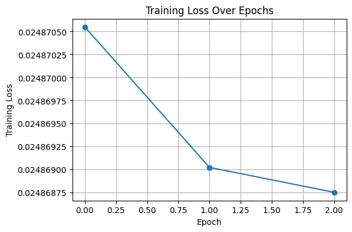
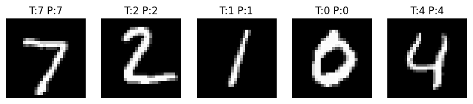
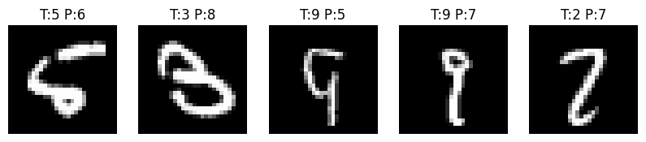

# Handwritten Digit Recognition with PyTorch

## Overview
This project implements an end-to-end handwritten digit recognition system using PyTorch. A convolutional neural network (CNN) is trained on the MNIST dataset to classify grayscale images of handwritten digits (0–9). The project focuses on building and understanding the full machine learning pipeline rather than optimizing model complexity.

---

## Dataset
- **MNIST Handwritten Digit Dataset**
- 28×28 grayscale images
- 60,000 training samples
- 10,000 test samples
- Labels range from 0 to 9

The dataset is loaded using `torchvision.datasets` and downloaded automatically during setup.

---

## Approach

### Data Preprocessing
- Images are converted to tensors using `torchvision.transforms`
- Pixel values are normalized to the range [0, 1]
- Training and test datasets are kept separate to avoid data leakage

### Data Loading
- DataLoaders batch the data efficiently during training and evaluation
- Training data is shuffled to improve learning
- Test data is not shuffled to ensure consistent evaluation

### Model Architecture
The model is a simple convolutional neural network consisting of:
- A convolutional layer for feature extraction
- ReLU activation for non-linearity
- A fully connected layer for classification into 10 digit classes

This architecture is intentionally minimal to emphasize clarity and learning fundamentals.

---

## Training
- **Loss function:** CrossEntropyLoss  
- **Optimizer:** Adam  
- Training is performed over multiple epochs  
- Training loss decreases over time, confirming that the model learns meaningful patterns  

*Figure:* Training loss decreasing over epochs, indicating that the model is learning meaningful patterns from the data.

---

## Evaluation
- The model is evaluated on unseen test data  
- Accuracy is computed by comparing predicted labels to ground truth labels  
- Final test accuracy: **~98%**  

Evaluation is performed with the model in evaluation mode and without gradient tracking.

*Figure:* Correctly classified handwritten digits from the test set, illustrating typical model predictions.

---

## Error Analysis
Misclassified test examples were inspected to understand model limitations. Common failure cases include:
- Visually ambiguous digits (e.g., 4 vs 9, 3 vs 5)
- Light or incomplete strokes
- Unconventional handwriting styles

This analysis highlights areas where a deeper model or data augmentation could improve performance.

*Figure:* Misclassified test samples showing common failure cases. Errors frequently involve digits with similar visual structure (e.g., 4 vs 9) or low-contrast handwriting, indicating reduced feature clarity.

---

## Model Persistence
The trained model’s weights are saved using PyTorch’s `state_dict`, allowing the model to be reloaded later without retraining.

---

## Future Improvements
- Deeper or more expressive CNN architectures
- Data augmentation to improve robustness
- Extension to handwritten letters (EMNIST) or full handwriting recognition
- Simple UI or CLI for interactive predictions

---

## Key Takeaways
This project demonstrates:
- End-to-end machine learning pipeline development
- Clean separation of data, model, training, and evaluation
- Practical experience debugging and validating a learning system
- Strong ML fundamentals suitable for applied ML or ML engineering roles
